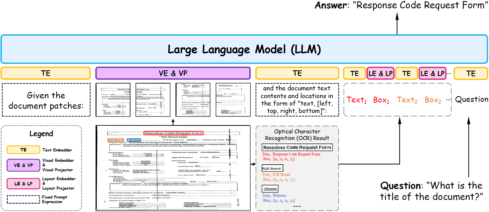

<div align=center>

# 🤓DocLayLLM: An Efficient Multi-modal Extension of Large Language Models for Text-rich Document Understanding

[](https://arxiv.org/abs/2408.15045) 
[](https://huggingface.co/liaowenhui/DocLayLLM_zero_shot)
[](https://github.com/whlscut/DocLayLLM)



</div>

## 🌟 Highlights
+ We propose **DocLayLLM**, a text-rich document understanding MLLM without the need of high-resolution image input.
+ **DocLayLLM** outperforms other doucment understanding methods with limited resources.

## 📅 News
- **2025.03.19**: Our repository is public! 👏🤗
- **2025.02.27**: 🎉🎉 Our [paper](https://arxiv.org/abs/2408.15045) is accepted by CVPR2025.   

## 🔥 Model Zoo
| **Model**                                    | **chekcpoint** | **status** |
|----------------------------------------------|----------------|------------|
| **DocLayLLM_zero_shot**                              | [huggingface](https://huggingface.co/liaowenhui/DocLayLLM_zero_shot) | Released  |

## 🚧 TODO List
- [x] Release DocLayLLM_zero_shot weights
- [ ] Release DocLayLLM_sft weights
- [ ] Release sft codes

## 🛠️ Installation
### Prerequisites (Recommended)
- Linux
- Python 3.8
- Pytorch 2.0.1+cu118
- CUDA 11.8

### Environment Setup
Clone this repo:
```bash
git clone https://github.com/whlscut/DocLayLLM.git
```

**Step 0**: Download and install Miniconda from the [official website](https://docs.conda.io/en/latest/miniconda.html).

**Step 1**: Create a conda environment and activate it.
```bash
conda create -n doclayllm python=3.8 -y
conda activate doclayllm
```

**Step 2**: Install related version Pytorch following [here](https://pytorch.org/get-started/previous-versions/).
```bash
# Suggested
pip install torch==2.0.1+cu118 torchvision==0.15.2+cu118 --extra-index-url https://download.pytorch.org/whl/cu118
```

**Step 3**: Install the required packages.
```bash
pip install -r requirements.txt
```

## 🚀 Inference

```
python infer_demo.py \
    --model_dir /path/to/DocLayLLM/weight \
    --img_dir /path/to/image \
    --ocr_dir /path/to/ocr/result \
    --instruction "Your question"
```
For example:
```
python infer_demo.py \
    --model_dir DocLayLLM_zero_shot \
    --img_dir example_data/rnbx0223_118.png \
    --ocr_dir example_data/rnbx0223_118.json \
    --instruction "What is the name of the company according to the logo?"
```

## 💙 Acknowledgement
- [llama](https://www.llama.com/)

## Copyright
- This repository can only be used for non-commercial research purposes.
- For commercial use, please contact Prof. Lianwen Jin (eelwjin@scut.edu.cn).
- Copyright 2025, [Deep Learning and Vision Computing Lab (DLVC-Lab)](http://www.dlvc-lab.net), South China University of Technology. 

## Citation
```
@inproceedings{liao2025doclayllm,
  title={Doc{L}ay{LLM}: An Efficient and Effective Multi-modal Extension of Large Language Models for Text-rich Document Understanding},
  author={Liao, Wenhui and Wang, Jiapeng and Li, Hongliang and Wang, Chengyu and Huang, Jun and Jin, Lianwen},
  booktitle = {Proceedings of the IEEE/CVF Conference on Computer Vision and Pattern Recognition (CVPR)},
  year      = {2025},
}
```
